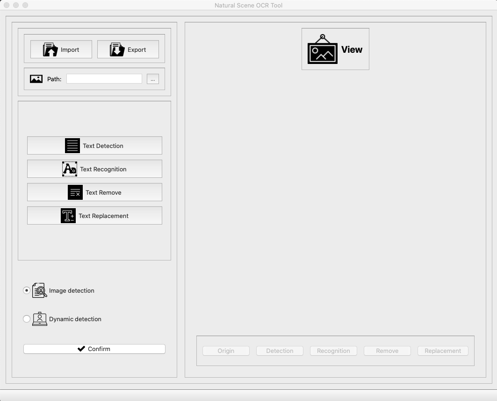

# Text-Detection-Project
## Core functionality
1. Text detection in both image and real time
2. Text recognition
3. Text deletion
4. Text replacement
## Details
1. Use EAST algorithm for text detection and implement this algorithm in python language.
2. Use open-sourced text recognition engine like Tesseract and computer vision API services such as Google Vision, and choose some of those implementing in text recognition feature.
3. Use image inpainting algorithms to implement text remove and text replacement features.
4. Develop a well-designed UI interface in Qt-designer
## Demo image

## Demo video link
https://youtu.be/p8ZC2G97zAQ
